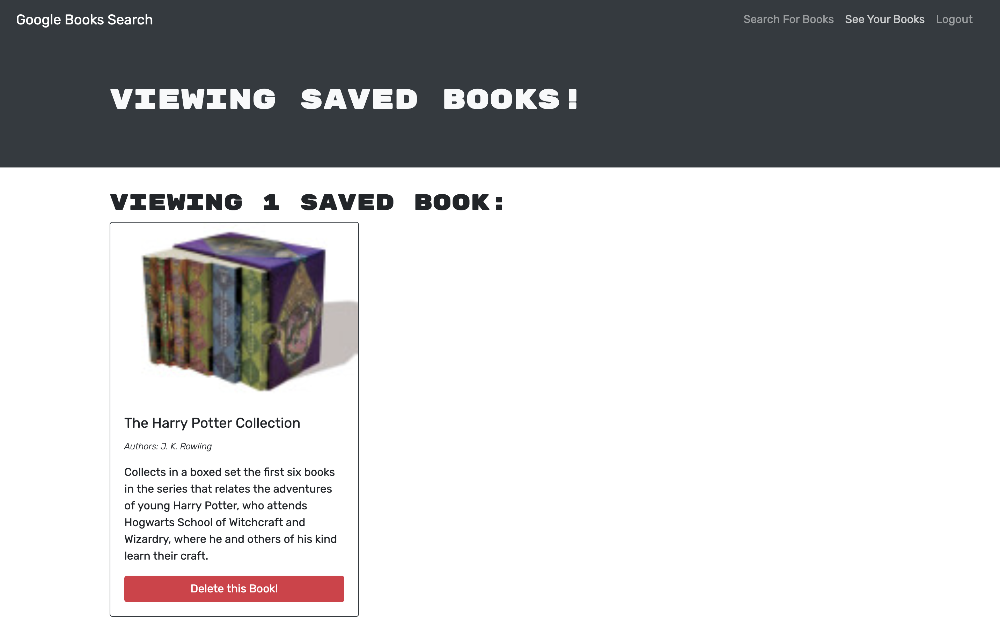

# MERN:Book Search Engine

## Description
This is a MERN stack application that allows the user to search for a book and save/delete books from the dashboard.
## Contents
* [Installation](#Installation)
* [Usage](#Usage)
* [Demo](#Demo)
* [Deployment](#Deployment)
* [Built With](#built-with)
* [License](#License)
* [Contact](#Contact)
## Installation
To start using this Book Search Engine you must follow these instructions:

Fork and clone this repository and save it to your computer. For help how to fork and clone click [here](https://guides.github.com/activities/forking/)

Open your terminal and make sure node.js is installed. To download node.js click [here](https://nodejs.org/en/download/)

Run command npm i to install all the dependencies in this repository.

Once all the packages have been installed, CD into the SERVER level of the file structure and run

npm run develop

Once you run the above command it will invoke frontend and backend server and the application will run on http://localhost:3000/ .
 
## Usage
A user can search for new books to read and save ones they are interested in so that they can keep a list of books to possibly purchase.

## Demo

## Deployment
- [Deployed Application](https://arcane-beyond-08361.herokuapp.com/)
- [Github Repo](https://github.com/akays89/bookSearch)

## Built With

* [MongoDB](https://www.mongodb.com/) - A popular NoSQL database management program.
* [Express](https://expressjs.com/) - A Node.js web application server framework used to build web applications. 
* [React.js](https://reactjs.org/) - A JavaScript Library used for building user interfaces.
* [Node.js](https://nodejs.dev/learn/) - Node.js is an open-source, low-level, back-end JavaScript runtime platform that uses asynchronous programming and is a popular tool for almost any kind of project!
* [Google Books API](https://developers.google.com/books) - An API that allows applications to retrieve book information from Google Books.

## License
MIT

## Contact
Please feel free to contact me at amandakays89@gmail.com for questions or feedback. 
To see other projects, please visit https://github.com/akays89/.
